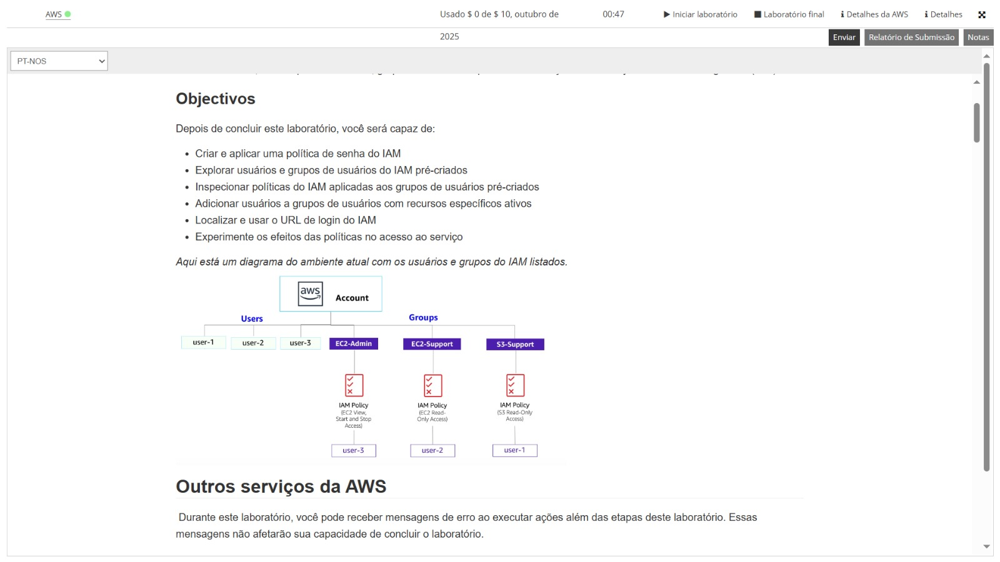
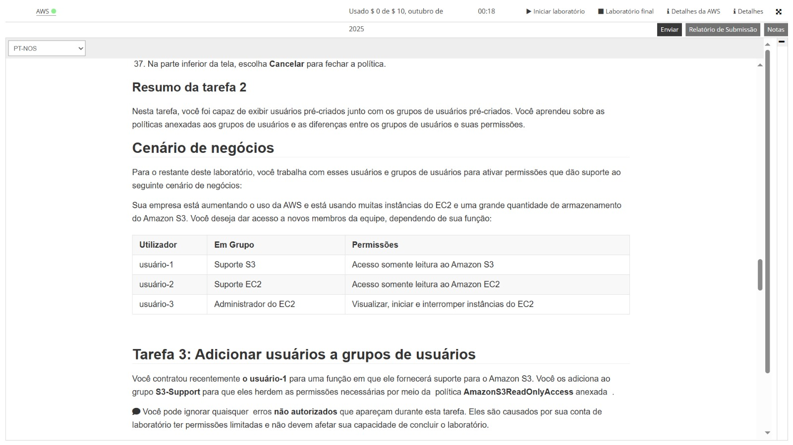
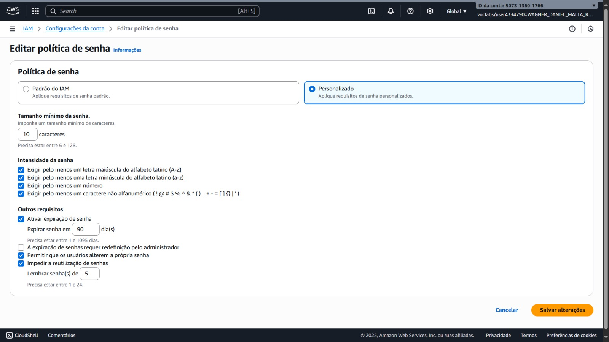
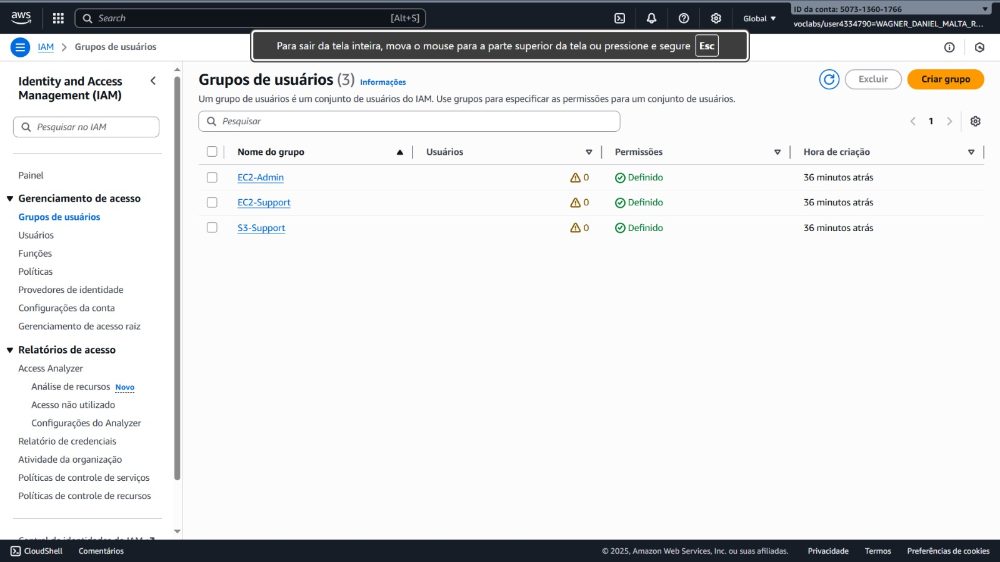
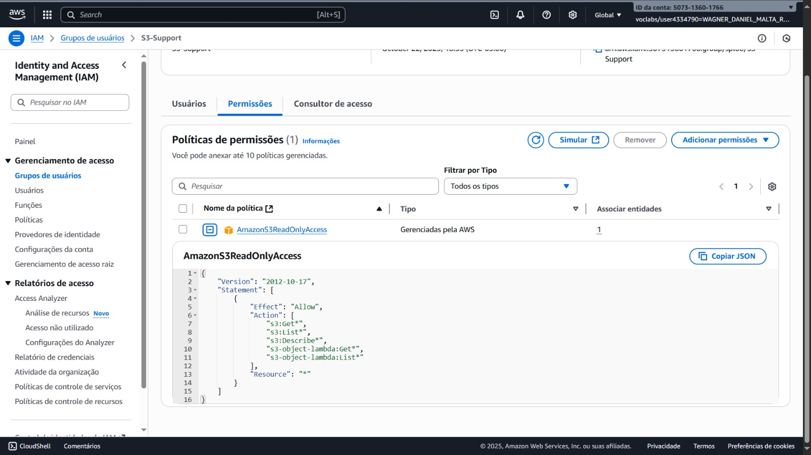
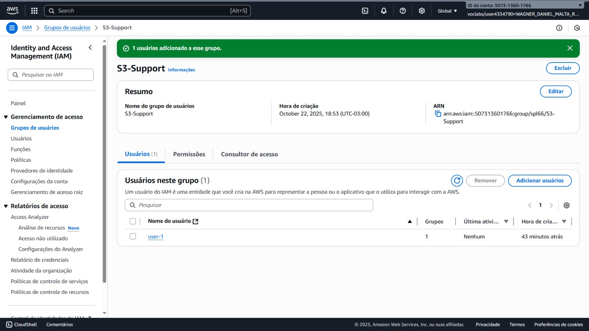
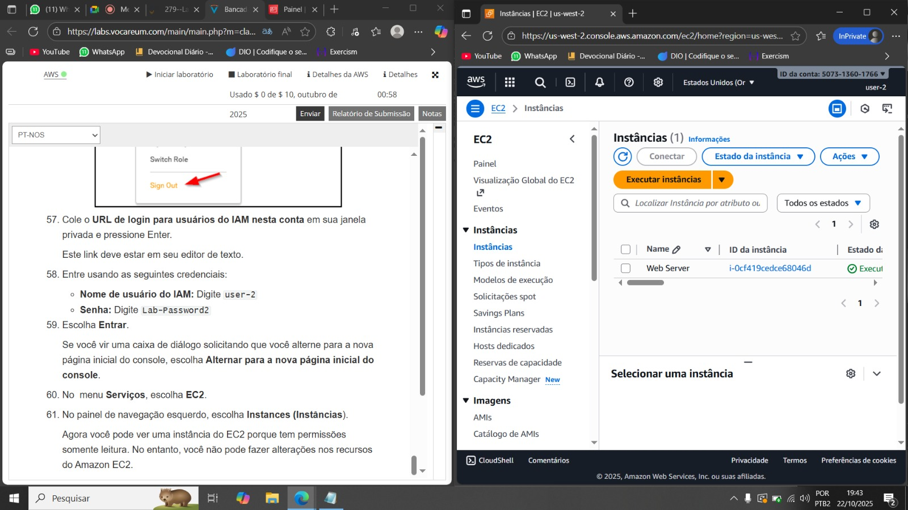
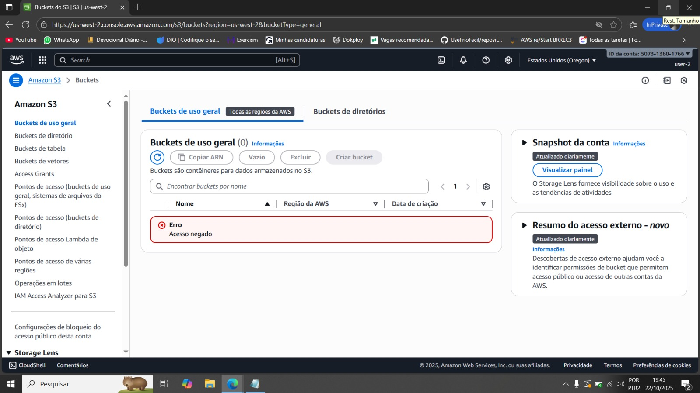
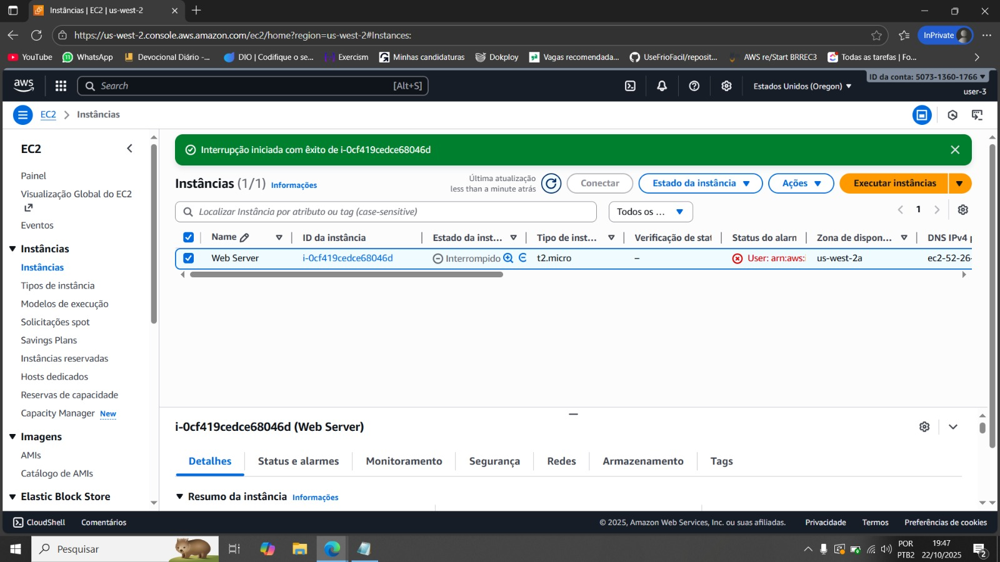

# 🔐 Laboratório AWS IAM — Gerenciamento de Usuários, Grupos e Políticas de Acesso

   

Este repositório documenta um laboratório prático realizado no serviço AWS Identity and Access Management (IAM), explorando conceitos fundamentais de controle de acesso na nuvem.

---

## 🎯 Objetivos do Laboratório

Após a execução do laboratório, o aluno será capaz de:

- Criar e aplicar políticas de senha do IAM
- Explorar usuários e grupos pré-criados no IAM
- Inspecionar políticas aplicadas aos grupos de usuários
- Associar usuários a grupos com permissões específicas
- Localizar e utilizar o URL de login do IAM
- Testar na prática o impacto das permissões na AWS

---

## 📋 Cenário de Negócios

Simulação de um ambiente corporativo com novos colaboradores recebendo permissões baseadas em função:

| Usuário | Grupo        | Permissão atribuída                                |
|--------|--------------|-----------------------------------------------------|
| user-1 | S3-Support   | Acesso somente leitura ao Amazon S3                 |
| user-2 | EC2-Support  | Acesso somente leitura ao Amazon EC2                |
| user-3 | EC2-Admin    | Visualizar, iniciar e interromper instâncias EC2    |

---

## 🛠️ Execução do Laboratório

### 1) Política de Senha Personalizada

Configurações aplicadas:
- Mínimo 8 caracteres
- Maiúsculas, minúsculas, números e especiais
- Expiração em 90 dias
- Bloqueio de reutilização das últimas 5 senhas

---

### 2) Exploração de Grupos IAM Pré-existentes

Grupos analisados:
- EC2-Admin — privilégios administrativos em EC2
- EC2-Support — leitura de EC2 apenas
- S3-Support — leitura de S3 apenas

#### Política do Grupo S3-Support

Política aplicada: AmazonS3ReadOnlyAccess  
Permissões principais:
- s3:Get*
- s3:List*

---

### 3) Associação de Usuários aos Grupos

Mapeamento conforme a função:
- user-1 → S3-Support
- user-2 → EC2-Support
- user-3 → EC2-Admin

---

### 4) Testes Práticos de Permissões

**User-2 (somente leitura EC2):**  
  
  
  

**User-3 (administrador EC2):**  
  

---

## 📊 Estrutura Conceitual de Políticas IAM

Modelo de política (conceitual):
{ "Effect": "Allow|Deny", "Action": "service:Action", "Resource": "arn:aws:service:region:account:resource" }

Tipos de políticas utilizadas:
- Políticas gerenciadas (AWS predefinidas)
- Políticas inline (anexadas a um único grupo/usuário)

---

## 🎓 Conclusões do Laboratório

Este laboratório demonstrou na prática:

- Segurança reforçada com políticas de senha
- Organização eficiente com uso de grupos IAM
- Aplicação do Princípio do Menor Privilégio
- Testes validando restrições em tempo real
- Escalabilidade do modelo baseado em grupos

O IAM é um componente central da segurança na AWS, garantindo que cada usuário possua somente o acesso que necessita, de forma controlada e auditável.
